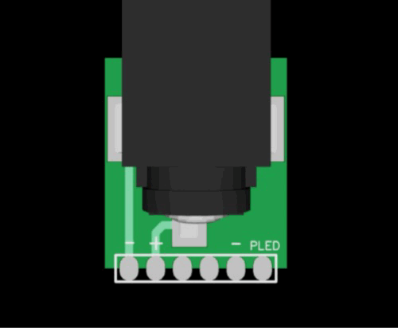
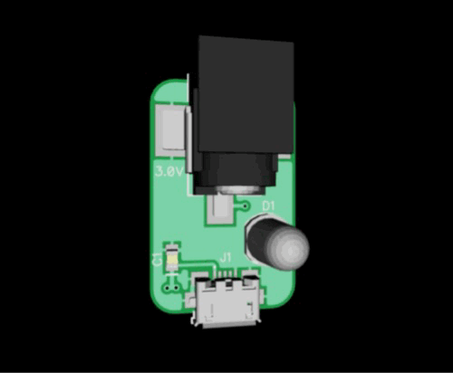

# pocket-operator-power-supply

Pocket operator USB power supply V1.  Designed in the last quarter of 2016. 

This is a power supply for the pocket operator series from teenage engineering. 

[teenage engineering](https://teenage.engineering)

The kit is inspired on how guitar pedals are powered and uses the same barrel jacks hence a daisy chain cable can be used. 

The system consists of a solderable part and a separate power supply.  

This kit once built requires some hacking, gluing and soldering to get a DC jack on your pocket operator.

Glue(with krazy glue or similar) and solder the DC jack on the top row of exposed pads on the top back of your pocket operator, connect the daisy chained cable, and the separate  power supply to a USB wall wart or USB rechargeable power bank by providing a micro USB cable.

Note: if using the power supply remove batteries before connecting this power supply, and never use both batteries and PO-PWS at the same time.

### Power supply how to use

### Jack

Notice that the board ends before the pads, this is to use castellated edges, make sure your fabricator can create these. 

### Power supply board

### Kit (Jacks and power supply)

### Jack soldered onto pocket operator

### Power supply bottom

## Design software

These boards were designed using DipTrace. 

## License

Released under the Creative Commons Attribution 4.0 License
https://creativecommons.org/licenses/by/4.0/